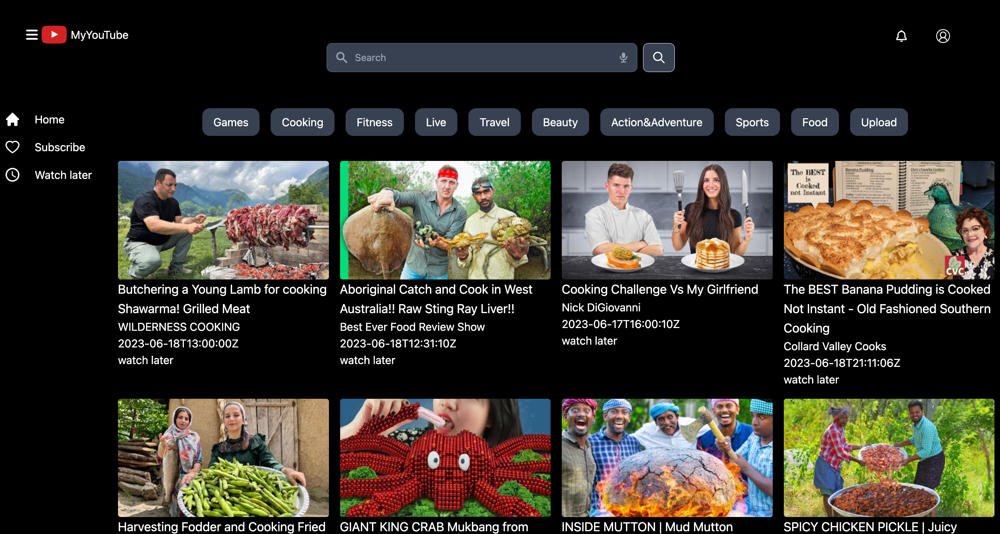

# Youtube-react
  

My Youtube list built by React.js

## Demo Link

- [My Youtube list](https://portfolio-react-liard-three.vercel.app/) 

## Built With

- `React.js`
- `Nodejs`
- `express`
- `MongoDB`
- `Mongoose`
- `TailwindCSS` 

## Features

- By using a search form, you can search for your favorite videos and display actual YouTube videos using the Google YouTube API. Furthermore, by signing in, you can add videos to your favorites, like or dislike them, and save them for later viewing. These actions do not affect the actual YouTube platform and allow you to save them as personal notes.

## Challenging Part

- I faced challenges in coordinating the client-side and backend-side interactions due to the limited number of fetches allowed by the Google API（The daily fetch limit for the Google YouTube API varies depending on the category). Additionally, obtaining tokens and storing user data in a database and local storage proved to be difficult.

## Setup

- Download or clone the repository
- Run `npm install`
- Run `npm run dev` to start running the app
